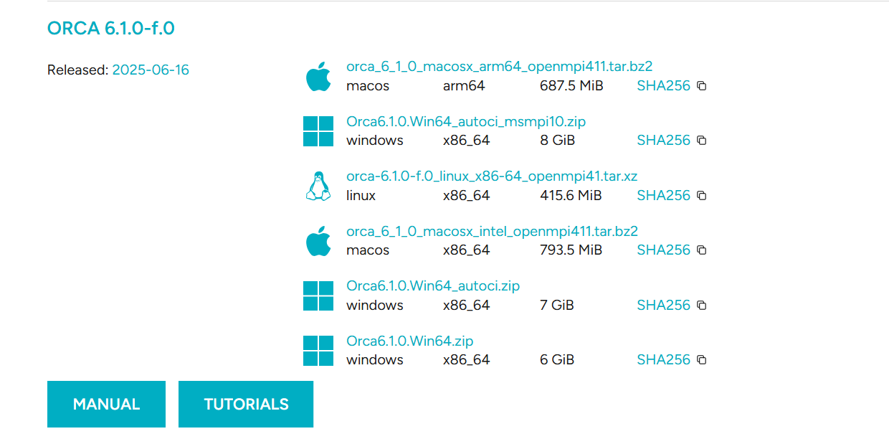
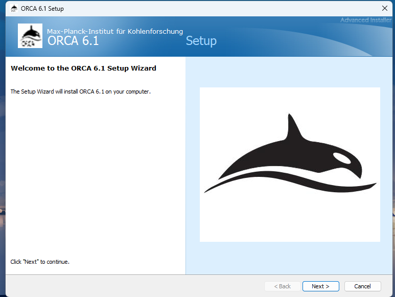
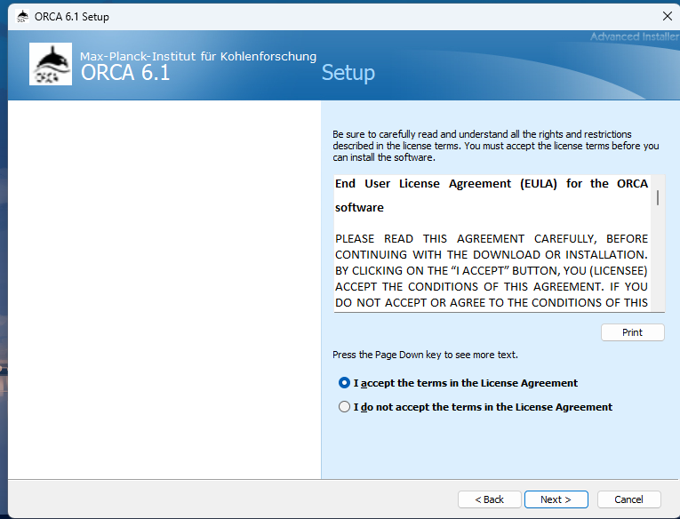
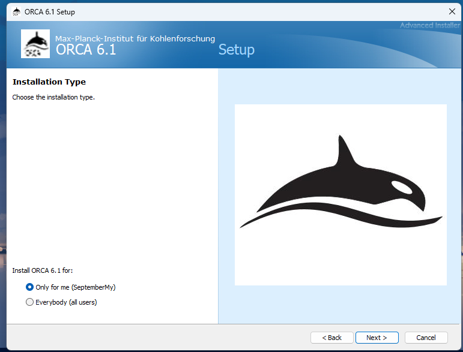
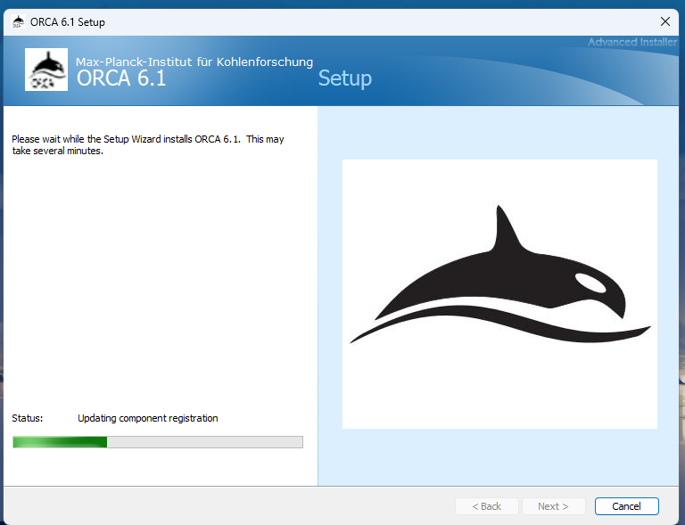
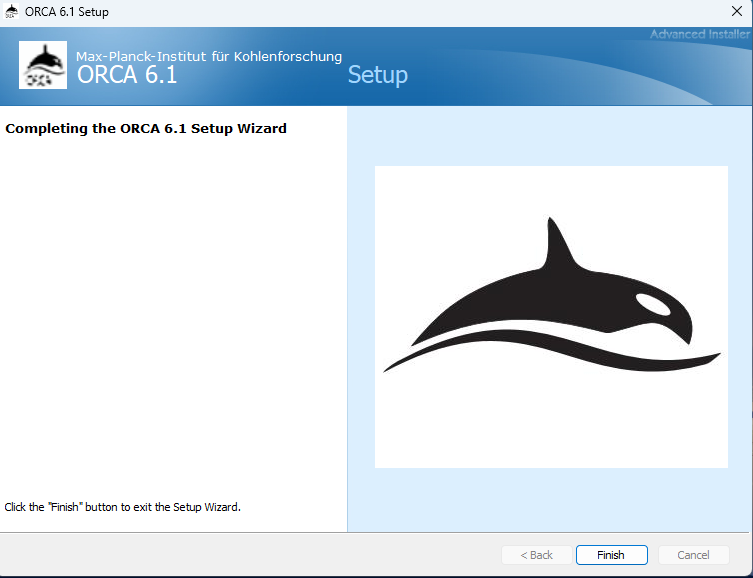
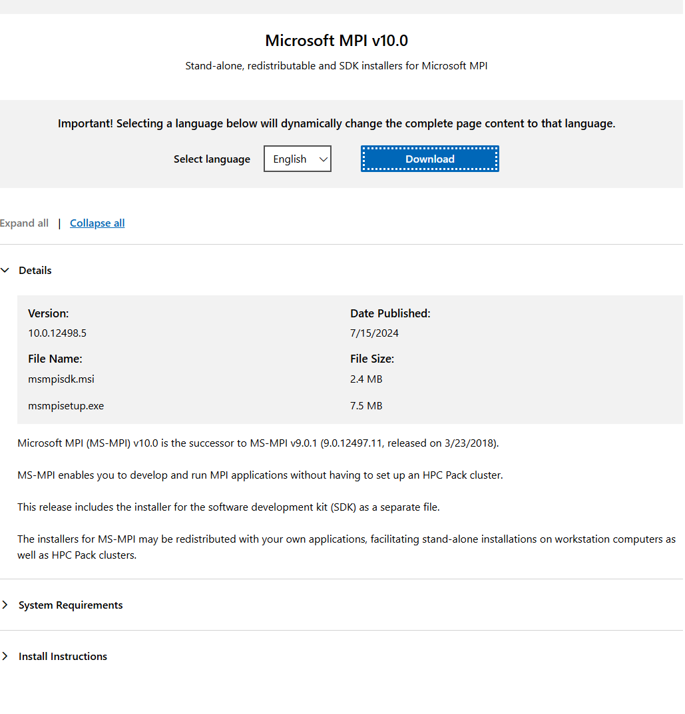
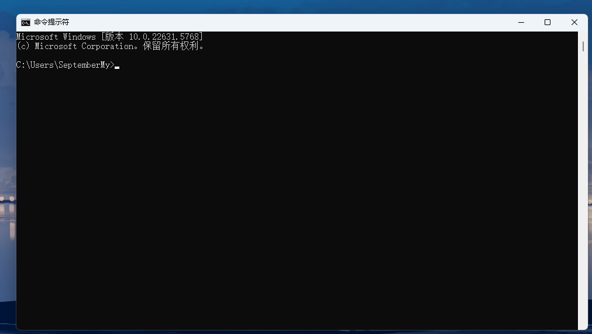

# ORCA简介
ORCA起源于Frank Neese于1999年在斯坦福大学完成博士后研究时开发的一个量子化学软件包，目前由MaxPlanck Institut für Kohlenforschung分子理论和光谱学系的研究小组和FACCTs GmbH开发维护。经过多年发展，目前版本的ORCA 6.1（截止2025年9月） 已经可以实现多种量子化学方法，包括半经验、密度泛函理论、多体微扰、耦合簇和多参考方法等。ORCA本身功能强大，近些年来流行程度越来越高，用户也越来越多。

ORCA对学术用户免费但闭源，只提供编译好的二进制程序，因此ORCA的安装很简单，不需要编译源代码。
# ORCA下载方式
ORCA官网是https://orcaforum.kofo.mpg.de，同时也是ORCA的论坛，进去注册个账号即可下载，但国内这个网址一般上不去。自ORCA 6.0之后，也可以在[faccts官网：](https://www.faccts.de/)https://www.faccts.de/ 下载ORCA及其手册，同样也需要注册。
**ORCA的手册内容详细(6.1版手册有1600多页)，既有理论知识也有丰富的例子，是非常有用的学习资料，十分建议阅读。**
目前ORCA提供了windows、Linux、Macos三个平台的二进制版本，Windows下有三个版本。ORCA有一部分后HF和多参考计算功能是只有autoCI模块才能做的，比如FIC-MRCI、CCSDT等，因此需要用到这部分功能的话需要下载含autoci的包，本课程一般用不到，所以三个包都可以，推荐下载名字带有msmpi10的版本，实测Orca6.1.0.Win64.zip也可正常运行。
**注意：含autoci的包解压后可能会很大，约30G。**

# 具体安装过程
ORCA 6.0 版本之后安装方式大幅度简化，可以完全通过GUI引导完成安装，下面以Orca6.1.0.Win64.zip 为例演示安装过程：
1. 下载相应的安装包Orca6.1.0.Win64.zip ，然后解压缩。
2. 进入解压缩后的 Orca6.1.0.Win64 文件夹，会看到有一个.exe程序 

3. 双击运行这个.exe文件，按照指引点击`next` 


4.选择接受协议，即`I accept ....`



5. 选择安装方式，是仅为当前用户安装还是为所有用户安装，这里关系到安装程序是仅向当前用户的环境变量中添加ORCA路径还是为所有用户都添加，一般情况下选择`only for me (xxx)`即可。



6. 这里可以选择性的安装串行版和并行版，建议选`Complete`，并在此步指定安装路径。 
**全部安装大概需要16GB硬盘空间。**


7. 点击`install`进行安装，等安装条走完即可。


8. 进度完成后点击`Finish`，即可完成安装。


9. (可选) 如果需要并行，还需要安装MSMPI，见下文。
# MSMPI的安装（可选）
上文提到，ORCA安装不需要用户自己编译源代码，理论上下载得到的二进制程序开箱即用即可，但ORCA基于MPI的方式进行并行计算，因此如果想要并行计算需要提供MPI库。

目前的6.1版本在Windows下是依赖于Microsoft MPI (MSMPI)库运行的，因此还要给系统安装MSMPI。ORCA 6可以搭配MSMPI 10.0运行。MSMPI 安装过程如下：
1. [微软官方下载MSMPI 10.0](https://www.microsoft.com/en-us/download/details.aspx?id=57467)，网址为：https://www.microsoft.com/en-us/download/details.aspx?id=57467 有.exe和.msi两种后缀的文件，下载.exe的即可。
2. 运行下载的后缀为exe的文件，按照引导完成安装即可，完成后会自动将MSMPI路径增加到环境变量中。
# 测试
安装完成后需要测试ORCA是否可以正常运行，下面给出一个例子并对Windows系统下运行ORCA的方式进行演示。
测试例子为cc-pVQZ基组下使用BLYP泛函对甲醛分子单点能的计算，输入文件内容如下：
``` bash
%pal
  nprocs 1
 end
! BLYP cc-pvqz 
 
* xyz 0 1
 C                  0.00000000    0.00000000   -0.56221066
 H                  0.00000000   -0.92444767   -1.10110537
 H                 -0.00000000    0.92444767   -1.10110537
 O                  0.00000000    0.00000000    0.69618930
* 
```
将上述文件保存为*test.inp*。
ORCA运行需要使用命令行进行，所以首先在系统搜索栏中输入`cmd`，打开命令提示符终端。

一般终端默认路径在C盘，假设ORCA安装路径为 *E:\orca* ，输入文件保存在 *E:\orcatest* 目录下，则需要先输入
``` bash
E:
```
切换到E盘目录，然后
``` bash
cd orcatest
```
进入到输入文件所在目录下，同时，此目录也是ORCA默认的工作目录。然后输入命令
``` bash
E:\orca\orca test.inp > test.out
```
运行ORCA，此命令会将输出内容写入`test.out`文件中。运行完成后，如果在`test.out`文件末尾发现 **\*\*\*\*ORCA TERMINATED NORMALLY\*\*\*\*** 字样，那么就表示本次任务正常结束。

上述例子是单核运行ORCA，若要测试多核运行，将上述输入文件中 `nprocs 1` 改为 `nprocs n` 即可，n为想要并行的核数。
**注意：n不要超过电脑的物理核心数**

此外，安装程序会自动将ORCA安装路径写入到环境变量中，因此运行命令也可以简写为
``` bash
orca test.inp > test.out
```
如果不能运行，可以右键点击`此电脑`依次打开`属性`、`高级系统设置`、`环境变量`、`Path` 查看ORCA安装路径是否被正确的写入到环境变量中。
# 参考资料
[1] [ORCA Manual Release 6.1](https://www.faccts.de/docs#orca)

[2] 卢天，[量子化学程序ORCA的安装方法](http://sobereva.com/451)


